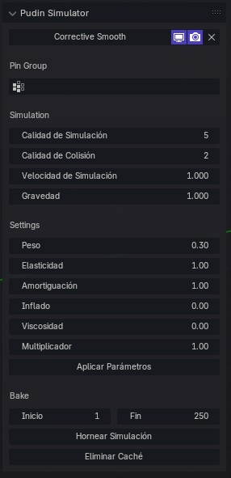

# Pudin Simulator - Guía Técnica

Esta guía cubre los principales parámetros para ajustar la simulación del addon "Pudin Simulator" y optimizar el comportamiento de la malla en Blender 4.2.

## Parámetros de la Simulación
1. **Masa Inicial**:
    - Iniciar con una masa de **1 (peso)** es recomendable como punto de partida y para asegurar un comportamiento base adecuado.
    - En cualquier momento posterior puede modificarse la masa para ajustar el peso sin comprometer ningún otro parámetro.
1. **Elasticidad**:
    - Determina cuánto se estira o comprime la malla.
    - **Valor de 0**: Altamente deformable.
    - **Valores superiores a 5000**: Menos deformable, muy rígido.
    - Si la maya vibra puede corregirse aumentando la calidad de la simulación o la amortiguación.
1. **Amortiguación**:
    - Controla la fuerza de rebote.
    - **Valor de 0**: Genera rebotes visibles.
    - **Valores superiores a 5000**: Evita cualquier rebote.
2. **Inflado**:
    - Añade volumen a la malla, similar al inflado de un globo de aire.
3. **Viscosidad**:
    - Hace que la malla se comporte de manera viscosa, como un globo de agua o piel humana. Produce ondulaciones al moverse y colisionar.
    - Al aumentar la masa la viscosidad puede romperse, puede disminuir su valor hasta corregir el problema.
1. **Multiplicador**:
    - Modifica proporcionalmente todos los valores anteriores.
    - Útil si la densidad de la malla ha cambiado (por subdivisión o decimación).

## Consideraciones para la Simulación y Colisión
- **Calidad de Simulación**: Se aconseja establecer la calidad entre **15 y 25**, o más si la complejidad de la simulación lo requiere.
  
- **Colisiones**:
    - Inicialmente fijar en **5**, ajustando posteriormente a **8, 10, o 15** según la calidad deseada.
    - **Densidad de la Malla**: La cantidad de polígonos afecta la cantidad de pasos requeridos; mallas con menos polígonos necesitarán menos pasos y viceversa.
- **Distancia de Colisión**:
    - Establecer una distancia mínima de **0.015**. Si la malla sigue atravesando el colisionador, aumente los pasos de simulación antes de incrementar los de colisión.
- **Colisionador**:
    - Para simulaciones con telas, el modificador del colisionador debe tener activada la opción `Single Sided`.

## Malla para Simulación
- **Reducción de Complejidad**: Utilizar la menor cantidad de polígonos posible, asegurando que la malla esté completamente cerrada (sin aberturas). Esto es crucial para que el inflado funcione correctamente.
  
- **Subdivisión**: Puede aplicarse un **modificador de subdivisión** antes del modificador de tela para mejorar el nivel de detalle sin comprometer la estructura básica.
  
- **Corrective Smooth**:
    - Desde el plugin, se puede añadir el modificador **Corrective Smooth**, que es altamente recomendado para suavizar las deformaciones de la malla.

## Fijación y Control de Física
- **Pin Group**:
    - Permite fijar la malla en puntos específicos, útil para mantener partes de la malla ancladas, especialmente en combinación con un **RIG**.
- **Control de Fuerzas**:
    - El **pin** también es útil para atenuar o minimizar el efecto de las físicas en ciertas áreas de la malla. Esto se puede gestionar mediante capas con el **modificador Vertex Weight Mix**.

## Densidad de Vértices
- Si la malla tiene áreas con una **mayor densidad de vértices**, esas áreas tendrán un mayor peso real durante la simulación, lo que puede hacer que se hundan en la malla. La única solución es reducir manualmente el número de polígonos; el uso del **pin** para controlar estos pesos no será efectivo.
